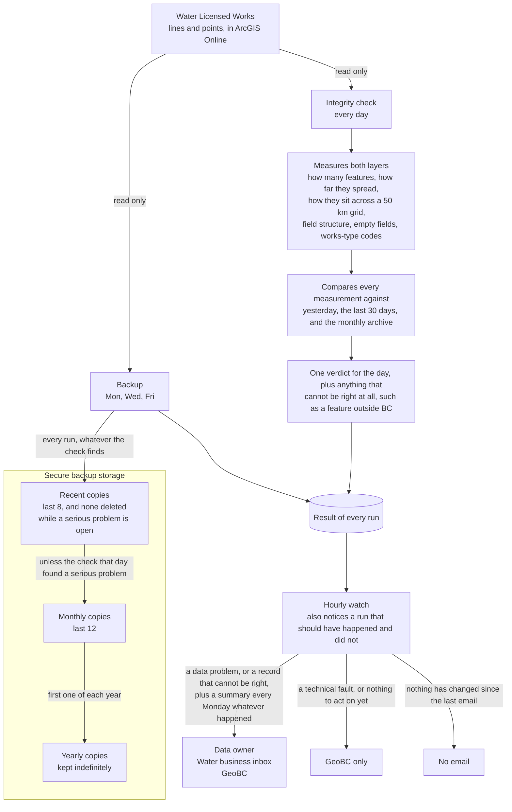

# Water Licensed Works — Backup and Integrity Checks

[](https://github.com/bcgov/repomountie/blob/master/doc/lifecycle-badges.md)

Scheduled backups and daily data integrity checks for the `WATER_LICENSED_WORKS_LINES` and `WATER_LICENSED_WORKS_POINTS` hosted feature layers in ArcGIS Online.

These two layers are edited through a web application (QuickWins) and by a number of ArcGIS Pro editors, and are pushed nightly into a BCGW staging geodatabase, which overwrites the previous contents. Before this project there was no backup of either layer and no validation of what the nightly push carried downstream. A bad bulk edit was both undetectable and unrecoverable.

This repository provides:

1. **Scheduled backups** of both layers, retained on a rotating, monthly and yearly schedule in object storage.
2. **Daily integrity checks** that measure the layers, compare against history, and raise an alert when something looks wrong.


## The pipeline never modifies production data

Everything here is **read-only** with respect to the production feature layers. The scheduled jobs authenticate, read layer definitions, run queries, and call `export()` to produce a file geodatabase — which creates a temporary item in the authenticating account's own content folder and deletes it once downloaded. No pipeline code deletes, appends, updates, calculates or truncates a feature under any condition.

**There is no automated restore, and there will not be one.** The response to a failed check is an alert. Recovery is a deliberate human decision made by the data owner after a problem has been diagnosed, because:

- Restoring discards every legitimate edit made since the snapshot, and only the data owner can weigh that trade-off.
- Automated recovery would turn a false positive into real data loss.
- The right response to an anomaly is frequently not a restore at all, but correction of a handful of records.

Restore procedures are documented runbooks carried out by a person. Any tooling written to support them stays outside the pipeline, is never referenced by a workflow, and requires explicit arguments and typed confirmation.

`restore/restore_layer.py` is that tooling, and the exception that proves the rule above: it is the one file here that can delete a feature. It is a resource for the data owner, not part of anything scheduled. Nothing imports it, no workflow can reach it, it reads no configuration and holds no object storage credentials, it authenticates only through `AGO_USERNAME_RESTORE` / `AGO_PASSWORD_RESTORE` rather than the pipeline's own credentials, it verifies the artifact's checksum before it deletes anything, and it changes nothing without `--execute` and a typed confirmation. The two production items are refused outright unless the run explicitly names who approved it. `tests/test_restore.py` asserts each of those as a property rather than trusting them as a convention. The procedure is [docs/RESTORE_inplace.md](docs/RESTORE_inplace.md).


## How it works



**Backup** runs Monday, Wednesday and Friday. It exports each layer to a file geodatabase, validates the downloaded artifact, writes a manifest and a copy of the service definition, uploads everything under a new date-stamped prefix, and only then prunes anything old. A failure at any point leaves the previous backup set untouched.

File geodatabase is used because it preserves field types, nulls, coded-value domains and subtypes. It does not capture hosted service configuration — item ID, sharing, symbology, sync settings — which is why the documented restore path preserves the existing hosted item rather than replacing it.

**Checks** run daily. They collect dataset-level metrics from live queries — feature count, extent, spatial bin distribution over a fixed 50 km grid, total length, schema fingerprint, null rates, distinct coded values — and compare each against the previous run, a rolling 30-day median, and the most recent monthly baseline. The result is one of `PASS`, `BASELINE`, `WARN`, `DATA_FAIL` or `SYSTEM_FAIL`.

Every one of those rules asks whether something *changed*. A separate class of finding asks whether the data can be right at all — a feature whose coordinates place it outside British Columbia is wrong on the first run and on the four hundredth, and no comparison will ever show it. Findings are reported in the run's details and never in its status, so a known-bad record raises an alert without blocking anything for as long as it goes uncorrected.

`DATA_FAIL` and `SYSTEM_FAIL` are kept distinct on purpose. An authentication failure or storage timeout is an operational problem, not a data anomaly; it alerts just as loudly, but it must never be allowed to block the nightly push for reasons unrelated to data quality.

**Notification** is a hybrid. The GitHub Actions jobs do all the work and write a status object to object storage on every run. A small JENKINS job on an internal GTS server polls those objects and sends email, because the internal mail relay is not reachable from GitHub-hosted runners. That job also asserts the schedule positively — if an expected run produced no result, it alerts. A scheduled job that silently stops otherwise looks identical to one that keeps passing.

Staleness is measured from the slot a run was *due* in, never as hours since the last run: the Friday-to-Monday backup gap is 72 hours by design and would otherwise raise a false alarm every weekend.

The poll is hourly and the email is not. Mail goes out on a change of situation, so a failure lasting five days produces two messages — one alert and one resolution — whichever frequency the job polls at. Polling frequently buys latency, nothing else.

The notification job reads the status objects and writes exactly one thing: its own record of what it has already sent, kept under a `notify/` prefix outside every backup tier. It deletes and copies nothing, and it holds no ArcGIS Online credentials at all.


## Repository layout

```
config.yml            all settings; read once at the entry point
requirements.txt      pinned dependencies
backup.py             export, manifest, upload, promote, prune
checks.py             metrics and comparison; importable, no arcpy
storage.py            object storage wrapper
status.py             run status object, and the helpers both jobs share
run_backup.py         entry point
run_checks.py         entry point
preflight.py          read-only environment and assumption check
jenkins/              notification job, with its own short requirements.txt
restore/              manual restore tool; not part of the pipeline, imported by nothing
tests/                known-answer tests for the check rules
docs/                 restore runbooks and guides
.github/workflows/    scheduled jobs
```

`jenkins/` is deliberately isolated and shares no imports with the rest of the repository. It installs from `jenkins/requirements.txt` — `boto3`, `PyYAML` and `tzdata`, all pure Python — so the server running it never has `arcgis` or a geodatabase reader installed. The small amount of duplication that isolation costs is deliberate and is marked as such in the code.

`checks.py` is isolated in the other direction: it never imports `backup.py`, which needs a geodatabase reader that the internal server has no reason to install just to run a few queries. Anything the two jobs share therefore lives in `status.py`, which imports nothing beyond `storage.py` and the standard library.


## Configuration

Everything tunable lives in `config.yml` — layer identifiers, storage prefixes, retention counts, schedules, alert thresholds and notification routing. There are no magic numbers in the code.

Values still marked `PLACEHOLDER` will be replaced with observed values after the baseline period, and should not be read as tuned.

**No secrets belong in `config.yml`, ever.** It is committed to a public repository.


## Environment variables

Secrets come from the environment only. The three stores below are independent — nothing propagates between them.

| Variable | Purpose | GitHub secret | Internal server |
|---|---|---|---|
| `S3_NRS_ENDPOINT` | object storage endpoint | ✓ | ✓ |
| `S3_GSS_GEODRIVE_KEY_ID` | object storage key | ✓ | ✓ |
| `S3_GSS_GEODRIVE_SECRET_KEY` | object storage secret | ✓ | ✓ |
| `AGO_USERNAME_WINS` | ArcGIS Online account | ✓ | — |
| `AGO_PASSWORD_WINS` | ArcGIS Online account | ✓ | — |
| `SMTP_HOST` | mail relay | — | ✓ |
| `SMTP_SENDER` | sender address | — | ✓ |
| `ALERT_*` | recipient addresses, one variable per role | — | ✓ |

Recipient addresses are held in environment variables rather than in `config.yml`; the configuration maps notification roles to variable names, so routing stays reviewable without publishing anyone's address.

The NRS object storage is S3-compatible. `endpoint_url` must always be passed explicitly or the client will silently attempt to reach AWS.

**Credential rotation:** schedule and owner *TO CONFIRM*.


## Local development

Requires Python 3.11 and [uv](https://docs.astral.sh/uv/).

```sh
uv venv --python 3.11
.venv\Scripts\activate        # Windows
source .venv/bin/activate     # Linux/macOS
uv pip install -r requirements.txt
```

Set the five GitHub-secret variables above in your own environment to run anything by hand.

If you have a conda environment active, `uv pip` may resolve to it rather than to `.venv`. Activate the virtual environment first, or pass `--python .venv/Scripts/python.exe` explicitly.

Run the tests with `pytest`.

Dependency versions are pinned. These jobs run unattended, and an unpinned dependency means a run that worked last week can fail this week for reasons unrelated to this code — which surfaces as a `SYSTEM_FAIL` and wastes an investigation.


## Schedules

| Job | Cadence | Local time |
|---|---|---|
| Backup | Monday, Wednesday, Friday — after hours, before the nightly staging push | 21:00 PDT / 20:00 PST |
| Checks | Daily, evening — after the day's editing, with time to act | 19:00 PDT / 18:00 PST |
| Notification poll | Hourly | — |
| Weekly summary | Monday morning | 08:00 |

The cadence settings in `config.yml` and the cron expressions in the workflow files must be kept in step, because the notification job uses the former to decide whether a run is overdue.

GitHub Actions cron is UTC and has no timezone support, so each slot is written in UTC and shifts by an hour across daylight saving. The backup's UTC day-of-week list is deliberately one day ahead of the local one: 21:00 on a Vancouver Monday is already Tuesday in UTC. The check runs two hours before the backup on the same local date, because promotion to the monthly tier depends on that day's check outcome.


## Storage layout

```
<bucket>/<project prefix>/
    rotating/   2026-08-12/   lines.gdb.zip  points.gdb.zip  manifest.json  servicedef.json
    monthly/    2026-08/      promoted copy of a rotating set whose check did not fail
    yearly/     2026/         promoted copy of a monthly set; never pruned automatically
    metrics/    2026-08-12.json
    status/     checks-2026-08-14T23:05:00Z.json
```

Monthly and yearly artifacts are **promoted**, not re-exported — a server-side copy of a set that has already been validated and whose data check did not report a failure. Re-exporting would produce a different snapshot, and would add low-frequency scheduled jobs that fail silently.

Promotion deliberately depends on the data check, not merely on a valid artifact. Artifact validation proves the file is intact; a faithful snapshot of corrupt data passes it cleanly. Without that rule, corrupt data could become the monthly baseline that every subsequent comparison is measured against.

Only a `DATA_FAIL` blocks it. A `WARN` is below the action threshold by definition, and a lesser data issue can go uncorrected for weeks — refusing to archive for that long would cost the month its copy over something nobody was acting on. The eligible outcomes are `promotion.promote_on` in `config.yml`.

The bucket is shared with other projects. Everything this project reads, writes, lists or deletes lives under its own prefix.


## License

Copyright 2026 Province of British Columbia

Licensed under the Apache License, Version 2.0. See [LICENSE](LICENSE).
